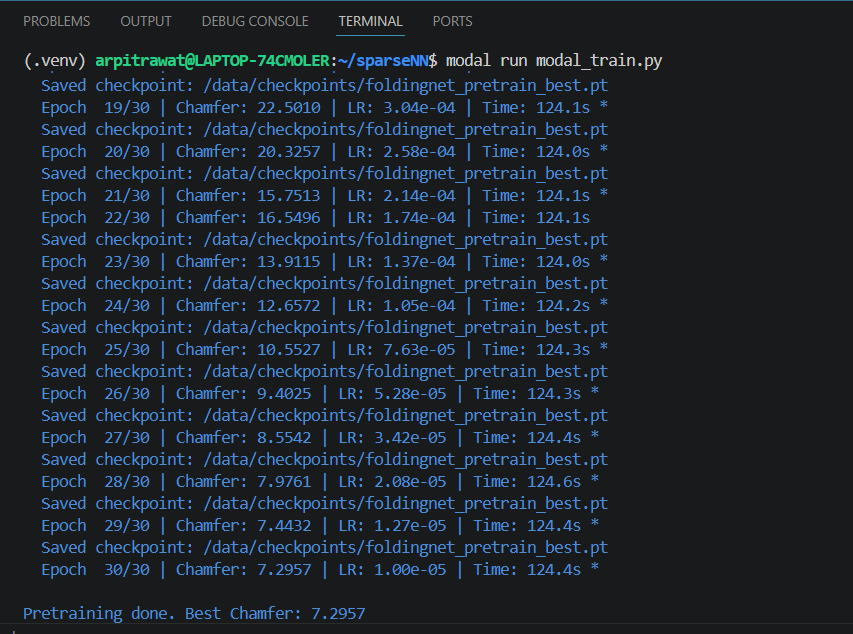
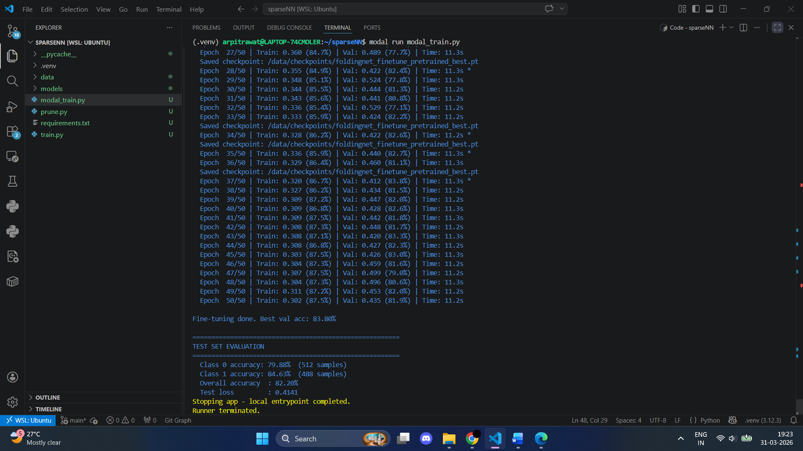
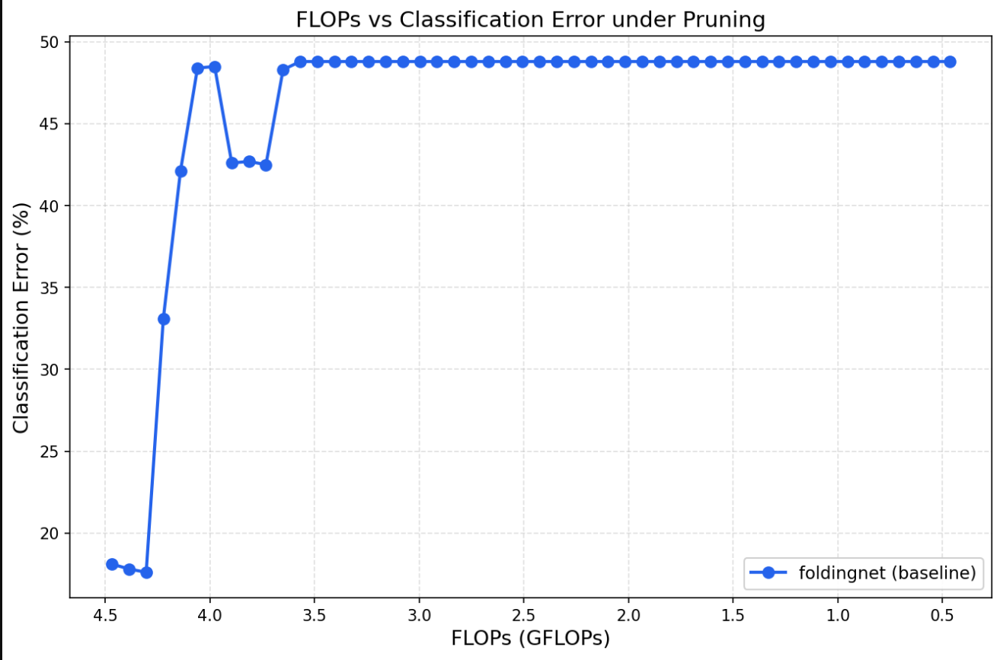
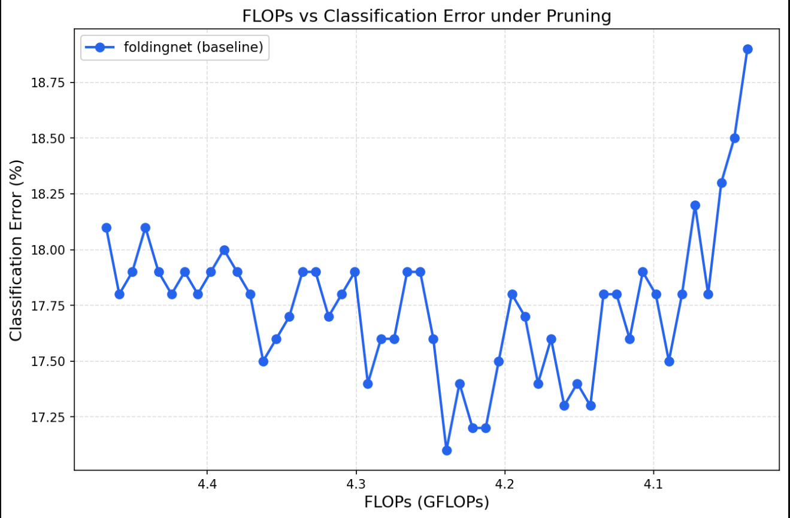

# Event Classification with Sparse Neural Networks

A two-phase training pipeline for binary event classification on particle physics data using point cloud autoencoders. Trains an unsupervised autoencoder on unlabelled data, fine-tunes the encoder for classification on labelled data, and benchmarks model robustness under unstructured magnitude pruning.

## Task Overview

The goal is to classify particle physics events into two binary classes using point cloud representations of detector hits. The challenge is that labelled data is scarce, so the approach is:

 - Pretrain a full autoencoder on a large unlabelled dataset using unsupervised reconstruction loss (Chamfer distance)
 - Fine-tune only the encoder + a small classification head on the labelled dataset
 - Prune the fine-tuned model and measure how classification error varies with compute (FLOPs)

## Dataset

Two HDF5 datasets are used:

 - Dataset_Specific_Unlabelled.h5 (~28 GiBs) (60k samples) for Pretraining (unsupervised)
 - Dataset_Specific_labelled.h5 (~4.7 GiBs) (10k samples) for Fine-tuning + evaluation
  
Each sample is a variable-length point cloud representing detector hits. Each point has 3D spatial coordinates plus additional hit-level features (total input dimension: 10 per point). The labelled dataset is split as follows:

Split : Train-Test-Val = 80:10:10

## Model Pipeline

### Phase 1 — Pretraining (Unsupervised)

The full autoencoder (encoder + decoder) is trained on the unlabelled dataset to reconstruct input point clouds. No labels are used.

```
Input Point Cloud (N × 10)
        │
        ▼
  FoldingNet Encoder
        │
        ▼
  Codeword (512-dim)
        │
        ▼
  FoldingNet Decoder
        │
        ▼
Reconstructed Point Cloud (2025 × 3)
        │
        ▼
  Chamfer Distance Loss
```

Loss: Chamfer distance between input and reconstructed point clouds.

### Phase 2 — Fine-tuning (Supervised)

The decoder is discarded. The pretrained encoder is attached to a small classification head and trained on the labelled dataset. The encoder is initially frozen (linear probe warm-up) and then unfrozen after a configurable number of epochs for full fine-tuning with differential learning rates.

```
Input Point Cloud (N × 10)
        │
        ▼
  FoldingNet Encoder        <- loaded from pretrained checkpoint
  (frozen -> unfrozen)
        │
        ▼
  Codeword (512-dim)
        │
        ▼
  Classification Head
  (512 -> 256 -> 2)
        │
        ▼
  Cross-Entropy Loss

Loss: Cross-entropy.
```

## Architecture

### FoldingNet Encoder

The encoder processes raw point clouds using a graph-based local feature aggregation approach:

 - k-NN graph construction - builds a local neighbourhood graph for each point (k=16 neighbours)
 - EdgeConv layers - aggregate edge features from local neighbourhoods to capture local geometry
 - Graph attention layers (graph1.fc, graph2.fc) - weight neighbour contributions via attention
 - MLP projections (mlp1, mlp2) - lift point features through: 19 -> 64 -> 64 → 64 -> 512 -> 1024 -> 512
 - Global max pooling — aggregates all point features into a single fixed-size codeword (512-dim)

### FoldingNet Decoder

Used only during pretraining. Takes the 512-dim codeword and reconstructs a point cloud of fixed size (m=2025 points) by "folding" a 2D grid into 3D space using two MLP stages. This is the source of most of the 24 MB pretrain checkpoint size.

### Classification Head

A lightweight MLP attached to the frozen/unfrozen encoder output:

Linear(512 -> 256) -> ReLU -> Dropout(0.3) -> Linear(256 -> 2)

Output is a 2-class logit vector for binary classification.

## Hyper Parameters

 - Learning rate for pretraining `pretrain_lr` = 1e-3 (with Cosine Annealing)
 - Number of samples used for pretraining `n_pretrain` = 50000
 - Epochs for pretraining `pretrain_epoch` = 30
 - Epochs for fine tuning `finetune_epochs` = 50
 - Learning rate for fine tuning `finetune_lr` = 1e-3
 -  Unfreeze encoder after `unfreeze_epoch` = 10
 - `batch_size`      = 128
 - `num_workers` for DataLoader = 4
 - bottleneck embedding size`codeword_dim` = 512,
 - maximum number of points per point cloud sample `n_max` = 2048

### Hardware

The training was done on single A100(40 GiBs) from cloud based provider Modal Labs.


## Results

The following results were yielded from training of this pipeline: 

### Pretraining



### Fine Tuning



### Pruning Encoder + Classification Head



The weights were pruned from 0 to 90% with equal jumps over 50 steps

During this full model pruning, the accuracy drops early on, probably as torch's prune starts pruning the smaller weights first, due to which the linear layers which store the bottleneck information is lost early on.

### Pruning Classification Head only



In only classification head pruning, the accuracy drop is not as significant and model also keeps trying to recover from pruning effect, as encoder stores information primarily.

The weights were pruned from 0 to 90% with equal jumps over 50 steps